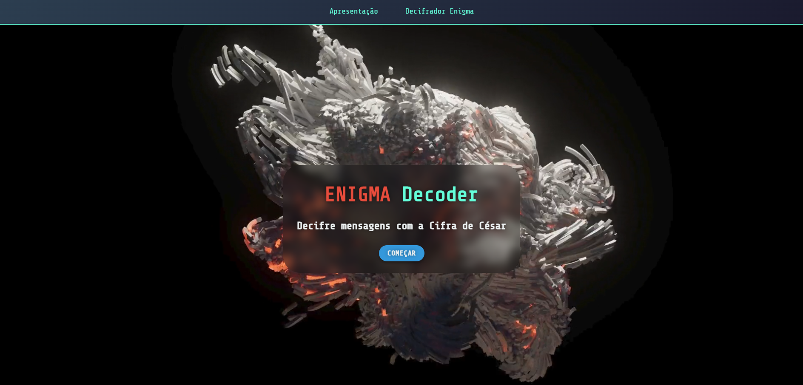
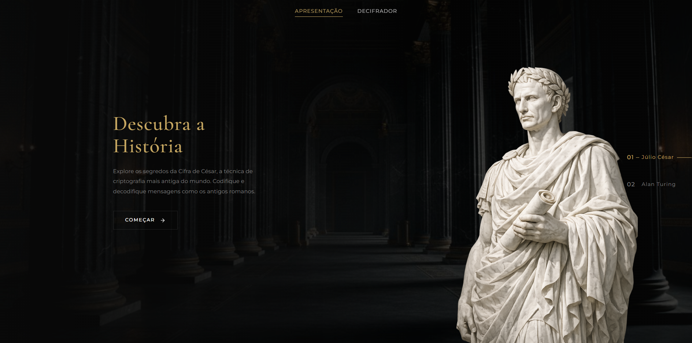
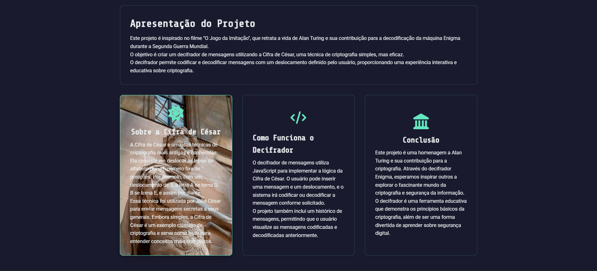
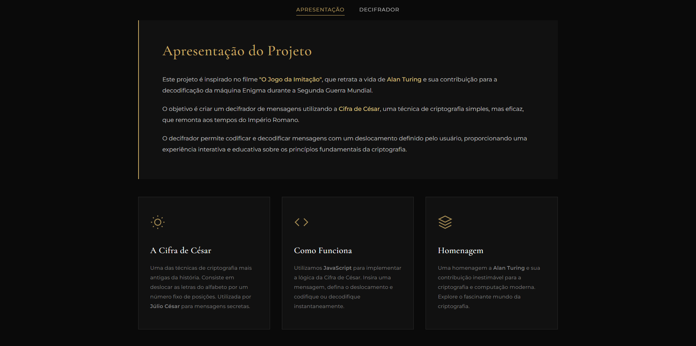
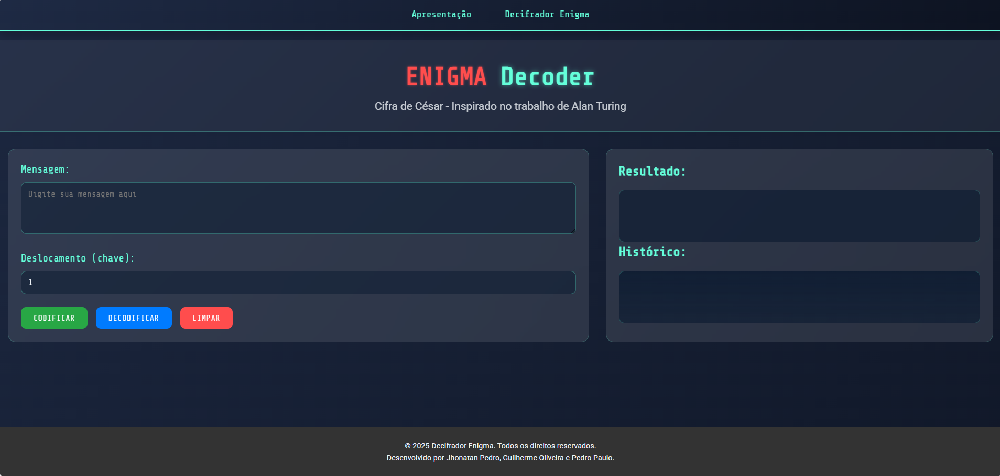
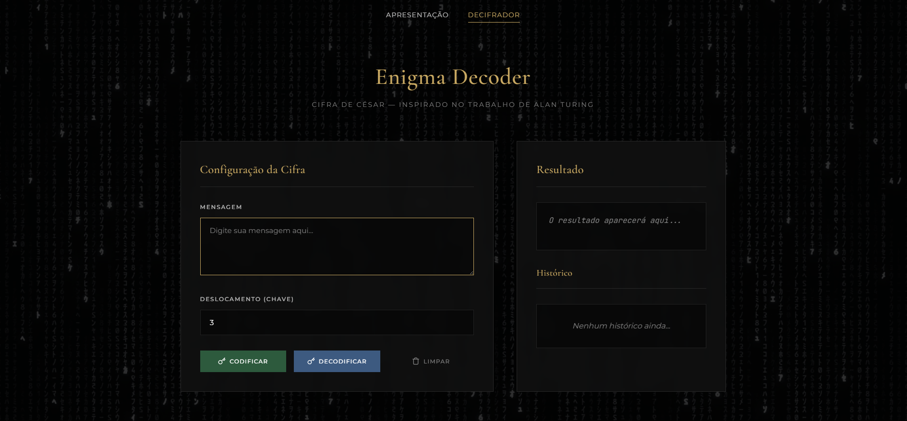

# Enigma Decoder

> Decifrador de mensagens baseado na Cifra de César — homenagem a Alan Turing e Júlio César.

**Conceito original desenvolvido em grupo no Senac (2025).**  
**Redesign visual completo realizado de forma independente para portfólio pessoal (2026).**

---

## ✨ Antes e Depois

### 🏛️ Hero Section

A hero section foi completamente refeita. A versão original usava um fundo com gradiente animado genérico. A nova versão conta com dois modos alternáveis — cada um com imagem de fundo, figura histórica e texto distintos.

<br>

| Versão Original | Modo César (novo) | Modo Turing (novo) |
|:---:|:---:|:---:|
|  |  |  |
| Gradiente animado simples | Fundo histórico + estátua de César | Fundo biblioteca + retrato de Turing |

<br>

### 📖 Página de Apresentação

| Antes | Depois |
|:---:|:---:|
|  |  |

<br>

### 🔐 Enigma Decoder (Decifrador)

| Antes | Depois |
|:---:|:---:|
|  |  |

---

## Sobre o Projeto

Este projeto foi originalmente desenvolvido como atividade em grupo no **Senac**, inspirado no filme *O Jogo da Imitação*, que retrata a vida de **Alan Turing** e sua contribuição para a decodificação da máquina Enigma durante a Segunda Guerra Mundial.

Após a entrega, decidi **redesenhar completamente a interface de forma independente**, com o objetivo de elevar o nível visual do projeto e incluí-lo no meu portfólio pessoal. Todo o CSS foi reescrito do zero, a estrutura de páginas foi reorganizada e novas tecnologias foram incorporadas.

O decifrador implementa a **Cifra de César**: uma técnica de criptografia clássica onde cada letra é deslocada por um número fixo de posições no alfabeto. Simples, porém elegante — e uma ótima introdução aos fundamentos da criptografia.

---

## 🆕 O que mudou no redesign

| | Versão Original (grupo) | Redesign (portfólio) |
|---|---|---|
| **Fontes** | Roboto + Share Tech Mono | Cormorant Garamond + Montserrat + JetBrains Mono |
| **Hero** | Gradiente animado estático | Dois modos alternáveis com imagens e figuras históricas |
| **CSS** | Dois arquivos separados | Arquivo único reescrito do zero |
| **Scroll** | Nativo | Smooth scrolling via biblioteca Lenis |
| **Fundo (decoder)** | Cor sólida | Vídeo em loop com overlay |
| **Animações** | Básicas | Transições de fade, entrada lateral, highlight no resultado |
| **Responsividade** | Parcial | Cobertura completa (375px → 1280px+) |
| **Estética** | Glassmorphism genérico | Editorial cinematográfica com paleta dourada |

---

## Funcionalidades

- **Dois modos no Hero**: alterne entre Júlio César e Alan Turing com transição suave de fundo, figura e texto
- **Codificação e Decodificação**: Cifra de César com chave configurável de 1 a 25
- **Histórico de Mensagens**: últimas 10 operações salvas no `localStorage`, persistindo entre sessões
- **Validação de Entrada**: feedback visual para entradas inválidas
- **Notificações toast**: mensagens de sucesso e erro animadas, sem bloquear a interface
- **Vídeo de fundo**: página do decodificador com vídeo em loop e overlay ajustado
- **Smooth Scrolling**: navegação fluida com Lenis
- **Interface Responsiva**: adaptada para smartphones (375px), tablets, o monitor SyncMaster 932B Plus (1280×1024) e desktops widescreen

---

## Tecnologias

- **HTML5** — estrutura semântica das páginas
- **CSS3** — layout com Grid e Flexbox, variáveis CSS, animações e responsividade completa
- **JavaScript** — lógica da Cifra de César, manipulação do DOM, `localStorage`
- **[Lenis](https://github.com/darkroomengineering/lenis)** `v1.1.14` — smooth scrolling
- **Google Fonts** — Cormorant Garamond · Montserrat · JetBrains Mono

---

## Como Usar

1. Clone o repositório ou baixe os arquivos
2. Abra `index.html` em um navegador moderno
3. Na hero, alterne entre **Júlio César** e **Alan Turing** pela navegação lateral
4. Clique em **Começar** para acessar o decifrador
5. Insira uma mensagem, defina o deslocamento (1–25) e clique em **Codificar** ou **Decodificar**
6. O resultado aparece no painel da direita; o histórico é salvo automaticamente
7. Use **Limpar** para resetar mensagem, resultado e histórico

---

## Estrutura do Projeto
```
enigma-decoder/
├── index.html              # Página inicial com hero interativo
├── decodificador.html      # Página do decifrador
├── style.css               # Estilização completa (único arquivo)
├── script.js               # Lógica do decifrador
├── imagens/
│   ├── julio_cesar.png
│   ├── alan_turing.png
│   ├── palacio_romano.jpg
│   ├── biblioteca.jpg
│   └── enigma_decoder.mp4
└── docs/
    └── images/             # Screenshots para o README
```

---

## Sobre a Cifra de César

A Cifra de César desloca cada letra do alfabeto por um número fixo de posições. Com chave 3, por exemplo: **A → D**, **B → E**, **Z → C**. Para decodificar, basta aplicar o deslocamento inverso. Caracteres não alfabéticos (números, pontuação, espaços) são mantidos sem alteração.

---

## Instalação
```bash
git clone https://github.com/seu-usuario/enigma-decoder.git
cd enigma-decoder
# Abra index.html no navegador — nenhuma dependência local necessária
```

---

## Créditos

**Conceito e versão original**
Jhonatan Pedro · Guilherme Oliveira · Pedro Paulo — Senac, 2025

**Redesign visual e melhorias**
Jhonatan Pedro — portfólio pessoal, 2026

Inspirado no filme *O Jogo da Imitação* (2014) e na história de **Alan Turing**.

---

## Licença

Distribuído sob a Licença MIT. Veja [`LICENSE.txt`](LICENSE.txt) para mais detalhes.

---

© 2026 Enigma Decoder · Jhonatan Pedro